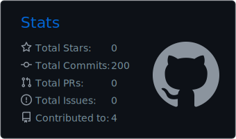
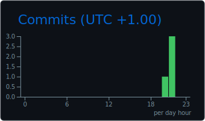

  

---

<h3 align="center">Projects</h3>

  
  &nbsp;
  
  &nbsp;
  

---

<h3 align="center">Tech Stack</h3>

  

  

  

  

---

<h3 align="center">GitHub Stats</h3>

  

  
  &nbsp;
  

  
  &nbsp;
  

Stats auto-generate via GitHub Actions

---

<h3 align="center">Activity</h3>

  

---

  
  &nbsp;
  
  &nbsp;
  

